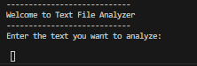
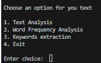
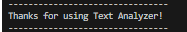
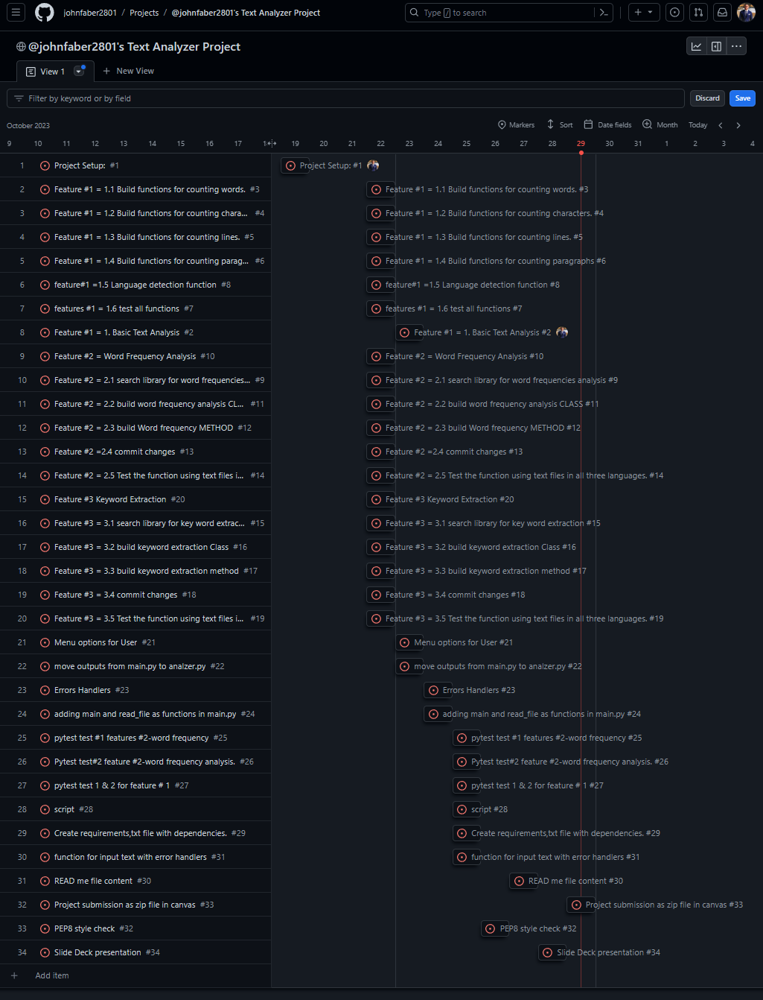
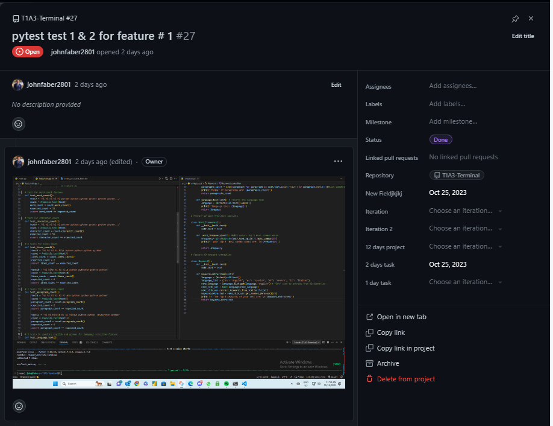
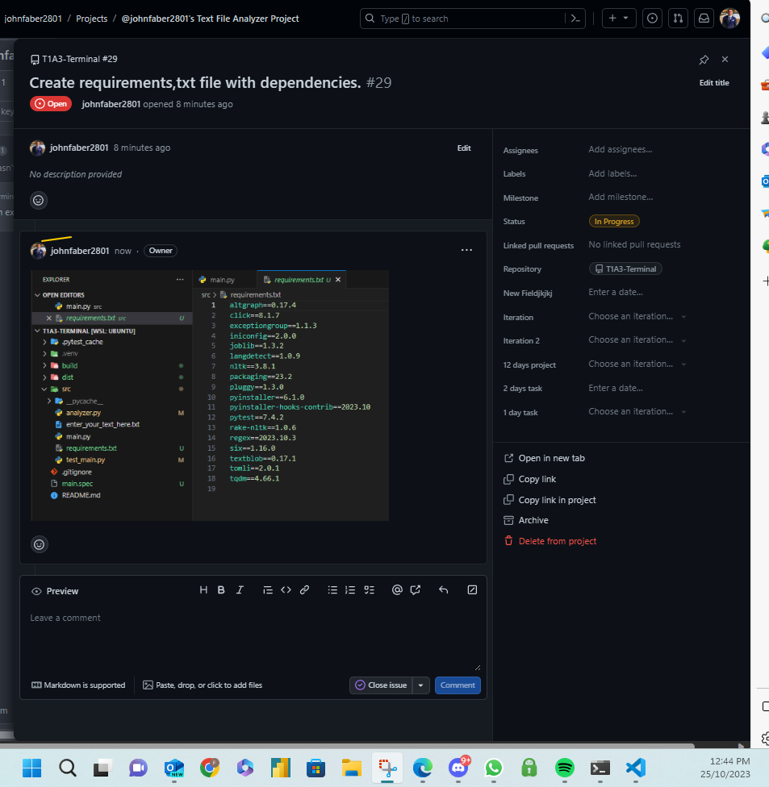
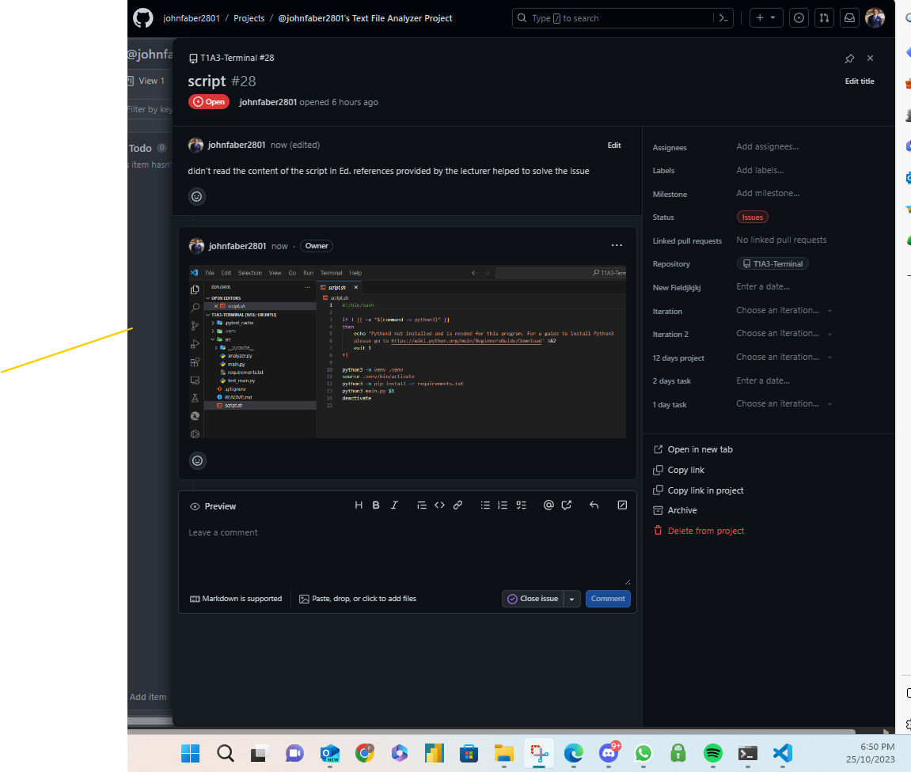

# Text Analyzer

## important links

- [Github repository](https://github.com/johnfaber2801/T1A3-Terminal)
- [Github board](https://github.com/users/johnfaber2801/projects/2)
- [Github Commits](https://github.com/johnfaber2801/T1A3-Terminal/commits/master)

## Code Style

[PEP8](https://peps.python.org/pep-0008/) was implemented as style for the Python code written in this project.

## Text Analyzer features

### Feature 1

#### Basic Text Analysis

This feature will analyze the text that was input by the user prior the option menu, the analysis will count the number of words, characters, lines and paragraphs of the input text, as well as the lenguage of it. The results will be displayed in a list.

Note: lenguages will be displayed as 'EN' for english, 'ES' for spanish, 'DE' for German, etc...

### Feature 2

#### Word Frequency Analysis

Allow users to know the Top 5 most frequent words, the program will count and display how many times each word appears in the text.

### Feature 3

#### Keywords Extractions

Allow users to extract the most frequent non-stop words from the text. Additionally, provide contextual analysis by displaying the sentences where each keyword appears.

Note: This process is set up to run the natural language process over texts written in English, Spanish, Italian, German, and French.

## Documentation

### Hardware Requirements

Operating System:

- Linux: RHEL 6/7, 64-bit (almost all libraries also work in Ubuntu)
- x86 64-bit CPU (Intel / AMD architecture). ARM CPUs are not supported.
- 4 GB RAM
- 5 GB free disk space

reference: [Enthought Python Minimum Hardware Requirements](https://support.enthought.com/hc/en-us/articles/204273874-Enthought-Python-Minimum-Hardware-Requirements)

### Software Requirements

- Python 3. to install Python3 guide [here](https://wiki.python.org/moin/BeginnersGuide/Download)
- Windows 7 or 10
- Mac OS X 10.11 or higher, 64-bit

### Required dependencies

```py
altgraph==0.17.4
click==8.1.7
exceptiongroup==1.1.3
iniconfig==2.0.0
joblib==1.3.2
langdetect==1.0.9
nltk==3.8.1
packaging==23.2
pluggy==1.3.0
pyinstaller==6.1.0
pyinstaller-hooks-contrib==2023.10
pytest==7.4.2
rake-nltk==1.0.6
regex==2023.10.3
six==1.16.0
textblob==0.17.1
tomli==2.0.1
tqdm==4.66.1
```

### Installation

1. Check in your terminal for Python if it is installed.

```bash
 python --version
```

It should return the python version, example below. Anything above 3 is good.

```bash
Python 3.10.12
```

if python it is not installed, go back to how to install it [here](https://wiki.python.org/moin/BeginnersGuide/Download)

2.Download text analyzer

Download the text analyzer file by navigating to the [Github repository](https://github.com/johnfaber2801/T1A3-Terminal) and select 'Download ZIP'


3.In your terminal, navigate to the directory 'T1A3-Terminal'

 ```bash
 cd T1A3-Terminal
 ```

4.From inside the 'T1A3-Terminal' directory, navigate the source folder.

```bash
cd src
```

5.Run 'script.sh' to install dependencies.

 ```bash
 ./script.sh
 ```

 or alternatively run

 ```bash
 bash script.sh
 ```

 the app should open after installing. if the app does not run, run the code below inside the 'T1A3-Terminal' directory.

 ```bash
 python3 src/main.py
 ```

 Notes: sometimes the terminal will prompt suggestions to install or update some dependencies, please follow the terminal instructions as these are vital for the app.

### Text Analyzer app instructions

1. you are going to be welcome by the app then ask you to enter your text to be analyzed.
( simply copy and paste your text or write yours) then press 'enter'.




2.Four options will pop,  please type 1, 2, 3 or 4 then 'enter' , the analisis will be shown after.



3 'Would you like to continue? (yes/no):' will prompt after the analysis result, and then you will have the option of going back to the menu, and using the others analysis for your text or exit the app.


4. a'Thanks' message will be shown meaning the app is terminated.



## Implementation Plan

The Text Analyzer project utilized the GitHub projects tool in order to execute features, tests, checklists, and any tasks related to the project. First, a creation of tasks for features 1, 2, and 3 was performed followed by checklists. example: Featuare #1 = 1.1 Build functions for counting words, Feature #1 = 1.2 Build functions for counting characters... etc. Then tasks such as error handlers, menu options, corrections, scripts, and more were specified. Majority of tasks contains comments, screenshots and sources links.

The implementation plan was reviewed and updated every day as well after tasks completed successfully, tasks completed at the end of the day were moved to the 'DONE' column list, while tasks not started yet were in 'TODO' column list, and the tasks being performed were in 'PROGRESS' column list. I created a new column named 'ISSUES' for tasks that presented difficulty issues.

The first screenshot below shows the timeline of the duration of the project with the dates of the tasks completed. 



### Feature #1


### Feature #2


### Feature #3


### Main


### Error handling


### Tests




### Dependencies



### Script



## Sources

- [datagy]( https://datagy.io/python-count-words/ )
- [pynative](https://pynative.com/python-count-number-of-lines-in-file/)
- [stackoverflow](https://stackoverflow.com/)
- [towardsdatascience](https://towardsdatascience.com/keyword-extraction-process-in-python-with-natural-language-processing-nlp-d769a9069d5c)
- [langdetect](https://pypi.org/project/langdetect/)
- [PEP8](https://peps.python.org/pep-0008/)
- [w3schools](https://www.w3schools.com/)
- [NLTK](https://www.nltk.org/)
- [pytest](https://docs.pytest.org/en/7.4.x/)
- [exceptions](https://docs.python.org/3/tutorial/errors.html)
- [pycodestyle](https://docs.python.org/3/tutorial/errors.html)
